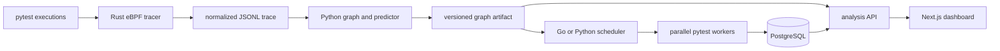

# ConflictGraph

ConflictGraph is an ML-driven CI test interference detector and conflict-aware scheduler. It learns risk from shared files, sockets, ports, databases, and logical resources, then schedules likely-conflicting tests apart.

The repository implements a staged workflow instead of hiding the data flow behind one command:



On Linux, the Go runner can register each test process with the tracer through cgroup v2. Replay mode supports graph, model, scheduler, API, and dashboard development on any platform without claiming to have observed the host kernel.

## Local setup

Python 3.10 or newer is required.

```bash
make setup
cp conflictgraph.example.yaml conflictgraph.yaml
.venv/bin/conflictgraph doctor
.venv/bin/conflictgraph collect benchmark/suite
.venv/bin/conflictgraph benchmark --profile quick --trials 2
```

Install the optional ML stack before training the GraphSAGE model:

```bash
.venv/bin/pip install -e '.[ml]'
.venv/bin/conflictgraph model train --profile standard --epochs 100
```

Start PostgreSQL, both APIs, the dashboard, and monitoring:

```bash
make services
```

- Dashboard: <http://localhost:3000>
- Analysis API: <http://localhost:8090/api/v1/health>
- Go control-plane API: <http://localhost:8080/api/v1/health>
- Prometheus: <http://localhost:9090>
- Grafana: <http://localhost:3001>

Compose initializes a new PostgreSQL volume from `controlplane/migrations/001_initial.sql`. Apply that migration explicitly when using an existing database.

## Trace, predict, and schedule

```bash
# Summarize and validate recorded events.
conflictgraph trace summary artifacts/traces/run.jsonl

# Build artifacts/graphs/latest.json. If a valid model exists, inference is used;
# otherwise the semantic shared-resource heuristic is recorded explicitly.
conflictgraph trace replay artifacts/traces/run.jsonl

# Preview or execute a schedule using predictions for the collected tests.
conflictgraph plan --workers 8 --policy balanced tests
conflictgraph run --workers 8 --policy balanced tests
```

The Go runner provides the persistent execution path. It reads the same graph artifact, stores tests, predictions, the schedule, and executions in PostgreSQL, and exits nonzero for test or infrastructure failures:

```bash
cd controlplane
go run ./cmd/conflictgraph run -config ../conflictgraph.yaml -directory .. tests
```

Generated traces, datasets, models, run records, and benchmark reports live under `artifacts/` and are intentionally not committed.

## Linux eBPF tracing

Real tracing requires Linux, cgroup v2, BTF, nightly Rust with `rust-src`, Clang, and `bpf-linker`. Capability-scoped deployments need `BPF`, `PERFMON`, and `SYS_RESOURCE`; some kernels require root.

```bash
rustup toolchain install nightly --component rust-src
cargo install bpf-linker --locked
./scripts/build-ebpf.sh
sudo tracer/target/release/conflictgraph-tracer \
  --mode ebpf \
  --output artifacts/traces/run.jsonl
```

The tracer captures bounded syscall and process metadata. It does not read file contents, packets, environment values, or credentials. Paths can be salted and hashed. See [Linux tracing](docs/tracing.md) for attribution and privacy boundaries.

## Scheduling and evaluation

The scheduler combines longest-processing-time placement with pairwise conflict probability and overlap duration. `aggressive`, `balanced`, and `safe` policies change risk weight and the threshold that prevents a risky overlap. Identical inputs and seed produce the same ordering.

The built-in benchmark is a synthetic replay for regression testing. It compares serial, random, heuristic, conservative, tabular-ML when dependencies are installed, a loaded GNN when one is present, and a clearly named oracle upper bound. Its report includes trial counts, confidence intervals, failures, makespan, utilization, and scheduler latency; it is not a kernel-tracing performance claim.

The controlled pytest suite can be run serially with optional Redis cases enabled:

```bash
.venv/bin/pip install -e '.[benchmark]'
docker compose --profile benchmark up -d redis
make benchmark-suite
```

## Repository layout

- `tracer/`: Aya eBPF programs and the Rust userspace collector.
- `controlplane/`: Go collection, scheduling, execution, persistence, and operational API.
- `python/conflictgraph/`: graph construction, inference, model training, replay, CLI, and analysis API.
- `dashboard/`: Next.js views for runs, conflicts, models, and benchmark artifacts.
- `benchmark/suite/`: controlled pytest interference cases and safe controls.
- `deploy/`: Compose-adjacent monitoring and the Helm chart.

Design details are in [architecture](docs/architecture.md), [ML methodology](docs/ml.md), [benchmark methodology](docs/benchmark.md), [operations](docs/operations.md), and [security](docs/security.md).

## Verification

```bash
make test
make lint
make go-test
make rust-test
cd dashboard && npm run lint && npm run typecheck && npm run build
```

Normal CI tests the userspace components and builds all four container images. Loading eBPF programs runs only in the separate privileged workflow on a tagged Linux runner.

## Current limitations

- Kernel tracing is Linux-only, and trace replay is a manual stage before scheduling.
- The Go runner supports pytest; other test frameworks need adapters.
- Logical Redis identities require explicit application instrumentation through `RedisTelemetry`; wire traffic is not decoded.
- The Helm tracer exposes a node-local Unix socket. A CI runner must execute on that node and register its test cgroups.
- Shared-resource evidence is probabilistic. Model quality depends on representative traces and labels.
- Replay benchmarks estimate counterfactual schedules; validate production policy changes with repeated real executions.

## License

Apache-2.0. See [LICENSE](LICENSE).

Portfolio: [Rohan Sinha](https://www.rohansinha.dev/).
